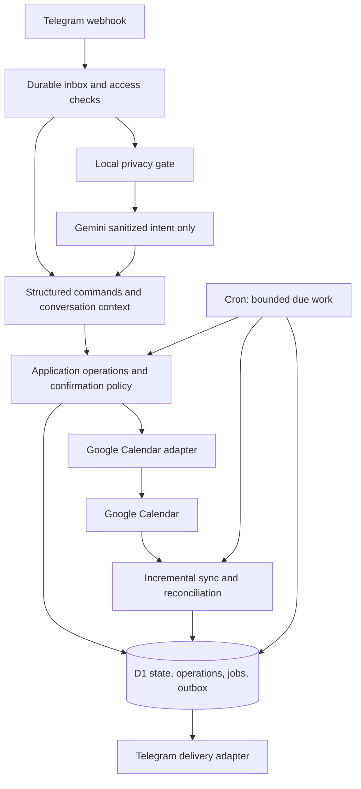

# Oh My Days — backend architecture and delivery plan

Status: Stages 1–2 implemented and tested locally (see §10); later stages proposed.
Nothing provisioned or deployed.  
Date: 2026-09-25; status updated 2026-09-27  
Source of truth: [product specification](../specs/oh-my-days.md).

## 1. Outcome and constraints

Build a private Telegram assistant for events and tasks, with Google Calendar as
the calendar interface. Deliver the complete first-version scope in the spec;
intermediate slices are engineering milestones, not scope reductions. Frontend
layout and branding execution will be discussed separately. Minimal authorization
HTTP endpoints are part of this backend plan.

Use free services only and retain deterministic operation without Gemini. Start
with the owner, but enforce independent user boundaries from the first migration.
The central engineering risks are safe retries, Calendar round trips, recurrence,
private-input sanitization, and shared free-tier capacity.

## 2. Architecture

Use one modular TypeScript Cloudflare Worker, one D1 database, and one scheduled
handler. Begin with native HTTP routing, parameterized SQL repositories and SQL
migrations, runtime boundary validation, and a small test runner compatible with
Workers. Proposed tooling: npm with a committed lockfile, Wrangler, TypeScript
strict mode, and Vitest with the Workers integration. Pin current compatible
versions during scaffolding. Add libraries only where they materially reduce risk;
benchmark timezone/recurrence libraries before adopting them.

D1 owns task lifecycle, lists, snoozes, preferences, interactions, operations, and
job state. Google owns provider event state and permissions. Local event records
are a versioned cache, never proof of current write permission. Task projections
are a synchronization boundary: supported external edits become domain commands,
then update application task state. There is no global “last writer wins” rule.

### Module boundaries

| Proposed location | Responsibility |
|---|---|
| `src/worker.ts`, `src/http/` | Fetch/scheduled entry points, routing, authentication, request limits |
| `src/domain/` | Task/event rules, date semantics, recurrence identities, confirmation and reminder policy |
| `src/application/` | Use cases, command validation, authorization, operations, conflict/Undo orchestration |
| `src/telegram/` | Commands, guided flows, callback references, pagination, message rendering |
| `src/calendar/` | Google transport, permissions, mapping, incremental sync and reconciliation |
| `src/interpretation/` | Local safe-template extraction, Gemini adapter, intent schema, fallback |
| `src/storage/`, `migrations/` | User-scoped repositories, constraints, atomic batches, migrations |
| `src/jobs/` | Durable job claiming, leases, retries, reminder/agenda/outbox delivery |
| `src/security/` | OAuth state, encrypted tokens, secret handling, input boundaries |
| `tests/` | Domain behavior, Worker/D1 integration, provider fixtures, acceptance scenarios |
| `docs/adr/`, `docs/runbooks/` | Decisions made during implementation and operating/recovery instructions |

Domain code imports no provider SDKs or Worker bindings. Application code depends
on narrow repository, clock, calendar, delivery, and interpretation interfaces.
Adapters translate errors into typed outcomes: retryable, auth-required, forbidden,
not-found, conflict, validation-failed, and outcome-unknown.

### HTTP and scheduling contract

- `POST /telegram/webhook`: verify the Telegram secret header, allowlisted sender,
  and private-chat identity. Atomically deduplicate and persist accepted updates
  before acknowledging. Return a retryable failure if persistence fails. Process a
  bounded amount immediately; the scheduler recovers unfinished inbox work.
- `GET /oauth/start`, `GET /oauth/callback`: short-lived, single-use linking state
  tied to an already authenticated Telegram user. Validate state and redirect URI,
  exchange authorization code server-side, identify the Google account, and reject
  unconfirmed account replacement. Never accept an arbitrary user ID as authentication.
- `GET /healthz`: minimal liveness only, without user or provider details. Telegram
  `/health` is authenticated and reports that user's connection and sync state.
- Optional `POST /google/notifications`: validate registered channel identity and
  token; only enqueue a coalesced sync hint. Implement after polling correctness.
- One proposed minute cron tick selects indexed due work. This is a scheduling
  target, not a delivery guarantee. Persist progress, bound pages/batches, and give
  reminders and interactive operations priority over maintenance. Do not rely on
  `waitUntil` or memory for durable completion.

## 3. Data model and time

Use opaque application IDs, UTC instants for execution times, IANA timezone IDs,
and explicit local-date values for date-only deadlines. Every owner-scoped key,
foreign-key relationship, query, and uniqueness constraint must preserve tenancy.
Use composite ownership references where supported to prevent cross-user links.

| Record | Important fields and constraints |
|---|---|
| users | Telegram ID unique; private chat ID; timezone; active/allowlisted status; settings version |
| google_connections | User/account identity; encrypted tokens and key version; scopes; reauth status |
| calendars | User + provider calendar ID unique; roles; permission; selected/default flags; task calendar identity |
| task_lists | User + ID; one Inbox per user; unambiguous normalized display names |
| task_series | User/list; recurrence rule/timezone; template; version; expansion cursor |
| task_occurrences | User/list; optional series; immutable occurrence key; title; deadline kind/value; status; version |
| event_cache / calendar_links | User/calendar/event ID; series ID + original start; ETag; relevant field snapshot; task link; tombstone |
| reminder_preferences | User/target occurrence; override and snooze-until; version |
| operations / confirmations | User; idempotency key; target/base version; intended patch; preview hash; recipients/scope; status; expiry |
| jobs / delivery_outbox | User; unique logical key; due-at; lease; attempt count; status; provider message ID; unknown outcome |
| sync_state | User/calendar; cursor/query shape; page progress; generation; last success; failure/outage state |
| inbox / interactions | Update ID unique per bot; owner; processing state; reply mapping; expiring clarification/context |
| contacts / change_history | User-scoped shortcuts; bounded before/after snapshots for valid Undo and recovery |

Index due job scans by `(status, due_at)`, tasks by `(user_id, status, deadline)`,
provider links by user/calendar/provider ID, and pending work by owner/state.
Represent date-only and timed deadlines with mutually exclusive fields and checks.
Exactly one list per task; completed, cancelled, and open are distinct states.
Completed/cancelled history must remain recoverable independently of the live cache.

Task occurrences keep their original identity when moved. Google recurring
instances are identified by calendar, recurring event ID, and original start,
not the mutable current start. Non-recurring events use calendar + event ID.

Proposed recurrence strategy: mirror native Google recurring series for deadline
projections and recurring events; materialize task occurrence state in D1 over a
rolling 90-day future horizon, extending on demand for views and with scheduled
maintenance. Keep all unfinished older occurrences, exceptions, and tombstones.
After a long outage, expand from the saved cursor in bounded pages so missed task
occurrences are not lost. Open-ended recurring tasks use an internal occurrence
schedule without inventing deadlines or calendar entries. Validate this strategy
in the recurrence spike before finalizing schema; bound generation even for long
outages. Follow documented invalid-date semantics instead of silently clamping.

Timezone changes alter future interpretation and agenda scheduling; existing
instants and series retain their stored timezone. Test DST gaps/folds, midnight,
month boundaries, leap years, Monday-start weeks, and exclusive all-day end dates.

## 4. Mutation, confirmation, and recovery protocol

All structured and interpreted requests enter the same typed command pipeline:

1. Resolve the user and target. Prefer an explicit reply reference, otherwise one
   uniquely recent discussed item. Reject multiple instructions without partial work.
2. Validate permissions, deadline/time values, scope, and required details. Clarify
   ambiguity using expiring user-bound interaction state.
3. Read the provider version for a Calendar mutation and construct the intended
   field patch. Persist the base values and operation before external writes.
4. Require confirmation for deletion/cancellation, whole-series changes, and attendee
   notifications. Store exact recipients, scope, patch, expiry, and source versions.
   Callbacks reference server-side state; stale or cross-user callbacks cannot act.
5. Apply local-only changes atomically with their jobs/outbox. For Google changes,
   revalidate current state and use conditional writes where supported. Merge only
   unrelated external changes; ask about same-field conflicts. Changed notification
   previews require renewed confirmation.
6. Persist the verified outcome and derived reminder/projection changes, then send
   a factual result. A local task awaiting its projection is explicitly pending.
   Record a version-bound Undo snapshot for eligible changes.

Operation states: `awaiting_confirmation → ready → applying → succeeded`, with
`retry_wait`, `needs_resolution`, `auth_required`, `failed`, and `cancelled` branches.
Claim work with atomic compare-and-set and expiring leases. Couple local state and
outbox changes in a D1 atomic batch; no transaction spans D1 and Google. Verify
actual D1 transaction semantics before implementation, rather than assuming a
long-running SQLite transaction is available across network calls.

Use stable provider-compatible event IDs for creates where supported. On a
write timeout or crash after the provider write, read/reconcile before repeating.
For edits, compare the current resource with the intended patch and base version.
Never blindly resend attendee notifications. Unknown notification outcomes remain
visible for reconciliation/manual resolution if they cannot be established safely.

Undo is a new validated inverse operation, permitted only when affected fields
have not changed since the original operation. It must respect confirmations and
cannot unsend messages. Retry with bounded exponential backoff and jitter; respect
provider retry hints. Revalidate time, permission, target, and preview on every retry.
Passed scheduled times and conflicting edits require user resolution.

Telegram delivery cannot be assumed exactly once: a send may succeed before a
worker loses the response. Store logical delivery keys and acknowledged message
IDs; distinguish unknown delivery from retryable failure. Avoid automatic blind
replay of unknown sends; record them in health and handle recovery through a
coalesced summary. Document this residual possibility of missed/duplicate delivery.

## 5. Synchronization and projections

Start with incremental polling, with a provisional five-minute interval per active
calendar and coalesced Force poll with a 60-second cooldown. Tune after measuring
usage; show last-sync time and do not promise instant updates. Add push hints only
if channel renewal and reconciliation fit the free budget.

Persist a consistent sync query shape. Apply pages idempotently and advance the
sync token only after the complete page sequence succeeds. An invalid token starts
a staged cache rebuild; retain application tasks and pending work. Reconcile only
a complete successful generation. Incomplete pages, lost access, and errors are
never evidence that all tasks were deleted. Incremental sync and recurring instance
expansion use separate provider requests/cursors as needed by API restrictions.
See [Google incremental synchronization](https://developers.google.com/workspace/calendar/api/guides/sync).

Map task markers using stable stored links and private metadata where available,
not titles. Parse recognized list annotations and the leading completion marker
only as supported external edits. Unknown annotations go through the spec's Inbox
rule without silently creating lists. Discover an existing task calendar through
verified identity or explicit user selection; a matching name alone is insufficient.

Use transparent/free all-day or timed deadline markers. Preserve the true deadline
separately from any display duration and verify it in Google Calendar. Removing a
deadline records an intentional projection deletion before calling Google; its
later deletion echo must not cancel the task. Completion keeps the projection;
external deletion cancels only the linked occurrence. Compare normalized supported
fields and provider versions to suppress update loops and preserve unrelated data.

External recurring edits and exceptions must retain original occurrence identity.
Test series edits against previously completed, cancelled, and moved occurrences;
never regenerate them as new open tasks. See [Google recurring events](https://developers.google.com/workspace/calendar/api/guides/recurringevents).

## 6. Reminders, views, and health

Compute indexed next-due jobs when targets change; do not scan all calendar rows
on every cron tick. Check target version/status again at delivery to suppress stale
reminders. Use one agenda key per user/local date and one reminder key per target,
kind, and schedule version. Handle timezone changes without sending a second agenda
for an already-delivered local date.

At 8am local time, render one combined agenda with events, due/overdue eligible
tasks, and an open-ended count. Date-only reminders are included there. Timed task
and event reminders are separate one-hour-before jobs. Snooze only replaces the
next reminder and suppresses automatic summaries until expiry. Exclude declined
and cancelled events and use no default timed reminder for all-day events.

Catch-up after downtime sends a coalesced summary of eligible overdue tasks and
still-upcoming missed event reminders; skip events already started. Define and
verify handling for future task deadlines with missed alerts and coincident agenda
and reminder jobs. Late-created items inside the reminder window use their creation
confirmation as the approaching notice rather than an immediate duplicate alert.

All specified slash commands, filters, pagination, navigation, task actions, and
settings operate without AI. Weekly/monthly boundaries are calendar periods in the
user timezone. `/health` reports pending/unknown operations and sync status. Alert
once after three completed failed checks, immediately on revoked access, and once
on recovery. Count a check once regardless of its internal retries. A hosting or D1
outage can delay the alerts themselves; an AI outage does not stop these features.

## 7. Security, privacy, and capacity gates

OAuth scope selection must cover selected-calendar reads, authorized event writes,
and task calendar creation with the least sufficient privileges. Record the exact
scopes and ongoing access strategy in the OAuth spike. Encrypt tokens with a
versioned authenticated-encryption key held in Worker secrets; plan rotation and
reconnection. Minimize retained inbox content and protect authorization state from
replay. Verify webhook secret, callback ownership, input sizes, output escaping,
and account-switch behavior.

Gemini is last in the delivery sequence. Start with locally recognized scheduling
templates and opaque content slots; send only an allowlisted action/timing
representation. Arbitrary prose is unsafe by default. If local extraction cannot
prove the outgoing representation contains only permitted information, offer guided
input. Never use an external model as the privacy filter. Validate outbound payloads
with adversarial synthetic fixtures. Recheck [Gemini service terms](https://ai.google.dev/gemini-api/terms),
model free eligibility, and project quota before enabling real requests.

Preserve the spec's operating targets (half of each account allowance; no other
application uses Workers or D1 in the account): 50,000 Worker requests/day,
2.5 million D1 rows read/day, 50,000 rows written/day, and 2.5 GB aggregate storage.
Start with one database and observe its separate size limit. Current documentation
lists 10ms Free Worker CPU and 500 MB per Free D1 database; these are implementation
constraints, not capacity measurements. Sources: [Workers limits](https://developers.cloudflare.com/workers/platform/limits/)
and [D1 limits](https://developers.cloudflare.com/d1/platform/limits/).

For an initial estimate, five-minute polling is 288 checks/calendar/day; the minute
cron is 1,440 invocations/day. Provider calls are not each a new incoming Worker
request, but do consume subrequests and provider quotas. Model pages, retries,
indexed rows, writes, and recurrence expansion separately. Measure actual account
usage including the existing application before deployment. Reduce maintenance
frequency or stop affected work before overrunning budgets; never enable paid overflow.

Proposed retention starting point: expire unused confirmations/OAuth state within
10 minutes, interaction content within 24 hours, processed raw inbox payloads as
soon as processing completes, and operation snapshots after 30 days. Retain minimal
deduplication records through the supported retry horizon. Keep recoverable task
history until an explicit retention policy is validated; do not equate snapshot
expiry with deleting cancelled tasks. Define backup/export and restore procedures,
and test restoration before release. Logs contain IDs, timings, counts, and redacted
error classes, never message bodies or tokens.

## 8. Build order and completion gates

Each numbered stage is one or more feature branches from `develop`, with small
commits for schema, behavior, and verification. Integrate through review. Do not
start dependent stages until their gates pass; document a failed feasibility gate
and revise the proposal rather than hiding it behind later work.

| Stage | Build in this order | Completion evidence |
|---|---|---|
| 0. Feasibility | Inspect shared account capacity when authorized; spike Worker/D1 execution, OAuth access/scopes, exact deadline markers, Google recurrence round trips; assess a safe Gemini input contract | Short decision records with measured constraints, scope choice, marker screenshots/results, and recurrence mapping; no paid dependency required |
| 1. Foundation | Scaffold strict TS Worker, local config, migrations, secret examples/ignores, repositories, clock interfaces, test harness; implement allowlist + durable Telegram inbox and private-chat routing | Local webhook-to-D1 slice works; duplicate updates, rejected users, and cross-user requests tested; migration/check commands documented |
| 2. Safe operations | Build operation state machine, atomic claims/outbox, confirmations, conditional versions, retries, reconciliation hooks, Undo policy with fake adapters | Crash-before/after-side-effect tests; repeated callbacks and stale previews cannot duplicate or bypass policy |
| 3. Google onboarding | OAuth + encrypted tokens, account link, calendars/permissions, default selection, task calendar identity, timezone/settings, minimal /health and auth alerts | Owner can connect via authorized smoke test; read-only calendars rejected for writes; reconnect/account replacement and token failures tested |
| 4. First event slice | Structured /event create, read, edit, delete, overlap check, exact results and Undo; incremental event sync, Force poll, pending recovery/conflict behavior | Round-trip event edits in both interfaces; timeout creates deduplicate; external conflicting edits require resolution; deletion confirmed |
| 5. Task/list slice | Inbox and lists, structured /task, open/date/timed deadlines, projection import/export, completion/reopen/cancel, remove-deadline intent, list moves/deletion | Spec's single-task scenarios pass through both interfaces; task markers are free time; projection deletion cannot accidentally cancel an open-ended task |
| 6. Time and delivery | Scheduler, reminders/overrides, daily agenda, snooze, overdue rules, catch-up, all required deterministic views and pagination | Fake-clock and Worker tests cover 8am dedupe, DST, skipped stale reminders, concurrent cron, completed targets, snooze, and actual calendar periods |
| 7. Recurrence | Native series + occurrence mapping, bounded expansion, exceptions, per-occurrence state, confirmed whole-series edits/deletes, grouped overdue views | Old unfinished occurrences survive; moved/deleted instances retain identity; month-end/leap-year behavior and outage backfill verified |
| 8. Invitations and conversation | Explicit emails/contact shortcuts, recipient previews, organizer restrictions, notification reconciliation, reply-context follow-ups; complete fallback flows and health behavior | No attendee notification without matching confirmation; stale preview re-confirms; no ambiguous follow-up mutation; one outage/recovery alert |
| 9. Optional interpretation path | Local privacy gate, configurable Gemini adapter, schema validation, safe intent-to-command mapping, quota/offline fallback | Outgoing payload inspection shows no private content; multi-action inputs cause no partial work; every deterministic feature works with Gemini disabled |
| 10. Release hardening | Full acceptance matrix, quota/CPU profiling, retention/restore drill, runbooks, authorized private deployment, owner smoke tests | Every spec acceptance row has evidence; limits and delivery caveats documented; no paid overflow; release approved and rollback/reauth paths exercised |

“Optional interpretation path” describes runtime availability, not removing natural
language from v1. Stage 9 must be validated before claiming full specification
coverage. Ordinary input that cannot be safely sanitized uses structured fallback.

## 9. Verification and handoff

At scaffold time define `lint`, `typecheck`, `test`, integration-test, and local
migration commands in the README. Until then, these are planned commands, not
existing tooling. Prefer domain tests for policy, local Worker/D1 tests for leases,
constraints and recovery, fake HTTP provider tests for sync/version failures, and
a small authorized real-account suite for contracts fakes cannot prove.

Create an acceptance matrix mapping every row of spec section 12 to tests and each
validation item in section 13 to measured evidence. Include concurrent requests,
unknown send outcomes, invalid sync tokens, lost permissions, user separation,
malicious callback data, unsafe AI input, and cost/CPU limits. Passing unit tests
alone is insufficient to release OAuth, Calendar projections, or invitations.

Do not provision services or send real invitations as a side effect of
implementation work. Frontend decisions remain outside this delivery plan.

## 10. Implementation status

| Stage | Status | Evidence |
|---|---|---|
| 0. Feasibility | Partial: local D1 semantics only | [Stage 0 status](../feasibility/stage-0.md); account-dependent checks pending |
| 1. Foundation | Implemented, tested locally | Webhook secret, allowlist, private-chat filter, durable deduplicated inbox, per-user serialized processing, outbox with unknown-outcome handling, scheduled recovery and retention (`tests/http`, `tests/jobs`) |
| 2. Safe operations | Implemented, tested locally with fake Calendar | Operation state machine, leases and guarded batches ([ADR 0001](../adr/0001-leases-and-guarded-d1-batches.md)), confirmations bound to preview hash, reconfirmation on changed targets, bounded retries with one pending notice, reconciliation after lost responses and crashes, field-level conflict detection, version-checked Undo (`tests/application`, `tests/domain`) |
| 3. Google onboarding | Implemented, tested locally with fake Google; not deployed or tried with a real account | OAuth with PKCE and single-use state, encrypted tokens (AES-GCM bound to user and purpose), scope and identity checks, account-replacement confirmation, interrupted-callback handling, token refresh with one auth alert per outage, calendar list and selection, default and task calendar (create or explicit link), timezone, `/settings`, `/health`, connection pages, homepage and privacy policy (`tests/flows`, `tests/google`, `tests/security`) |
| 4–10 | Not started | — |

Stage 2 decisions to review:

- Undo of a just-created event is a deletion, so it shows the standard delete
  confirmation (decided 2026-10-02). It is bound to the created version; any
  later edit makes Undo unavailable. Undo of a deletion is not offered yet.
- Users outside the allowlist who message the bot privately receive "This bot
  is private." as the webhook response; nothing about them is stored, and
  group chats get no reply (decided 2026-10-02).
- Callback effects (confirm/cancel/undo) commit in their own batch, keyed by the
  Telegram callback query ID, rather than inside the inbox lease; a redelivered
  press reports the original result.
- Calendar event handlers (create/patch/delete) now run against the Google
  adapter, but no command creates events yet (stage 4).

Stage 3 decisions and gaps to review:

- Served at `ohmydays.xinweichong.com` with a homepage and privacy policy for
  OAuth verification ([ADR 0002](../adr/0002-custom-domain-and-oauth-verification.md)).
- The OAuth app stays in Testing until verified, so access expires every 7 days
  and the bot asks for reauthorization.
- Setup ends with a summary instead of the brief's **Add event · Add task · View
  today** buttons, because those features do not exist yet (stages 4–6).
- `/health` has no **Force poll** button and no sync time until stage 4 adds sync.
- A "Calendar access wasn't granted" page state was added for users who untick
  Calendar permissions on Google's consent screen.
- Finished operations are purged after 30 days, as the privacy policy states.
